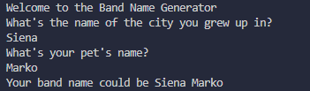

1. Create a greeting for your program
2. Ask the user for the city that they grew up in
3. Ask the user for the name of their pet
4. Combine the name of the city and the name of the pet and show them their band name
5. Make sure the input cursor shows up on a new line

my output of the program

