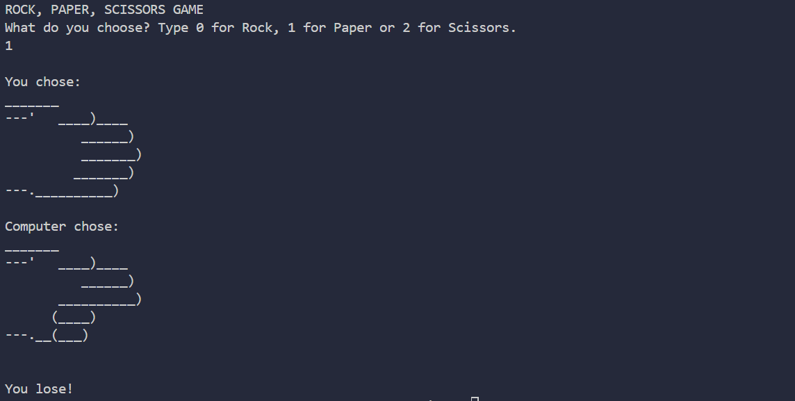

Day 4 Project
 
Rock, Paper, Scissors

Introduction to the Rock, Paper, Scissors Project
Now that all the necessary knowledge has been acquired, it is time to tackle the final project of the day: a Rock, Paper, Scissors game that can be played against the computer. The game begins by prompting the user to type 0 for rock, 1 for paper, or 2 for scissors.

When a choice is made, the program displays a graphic representing the user's selection, followed by the computer's randomly generated choice. The outcome is then determined based on the official rules: rock beats scissors, scissors beats paper, and paper beats rock.

Program Result:
